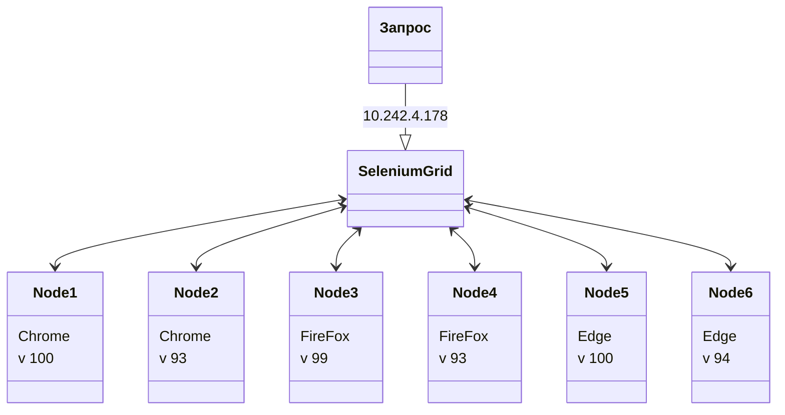
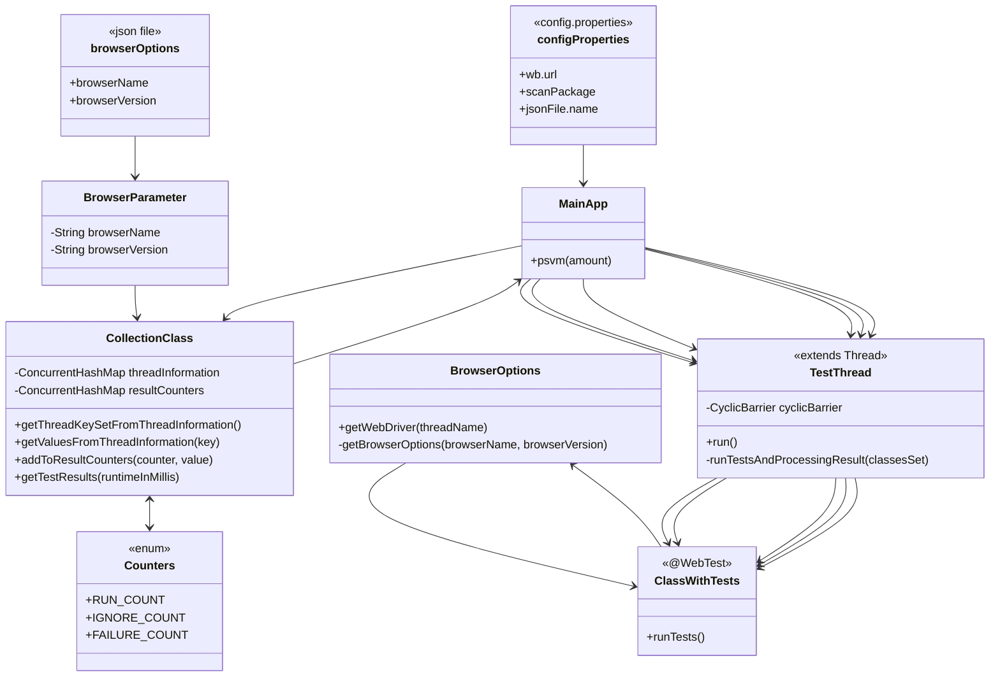
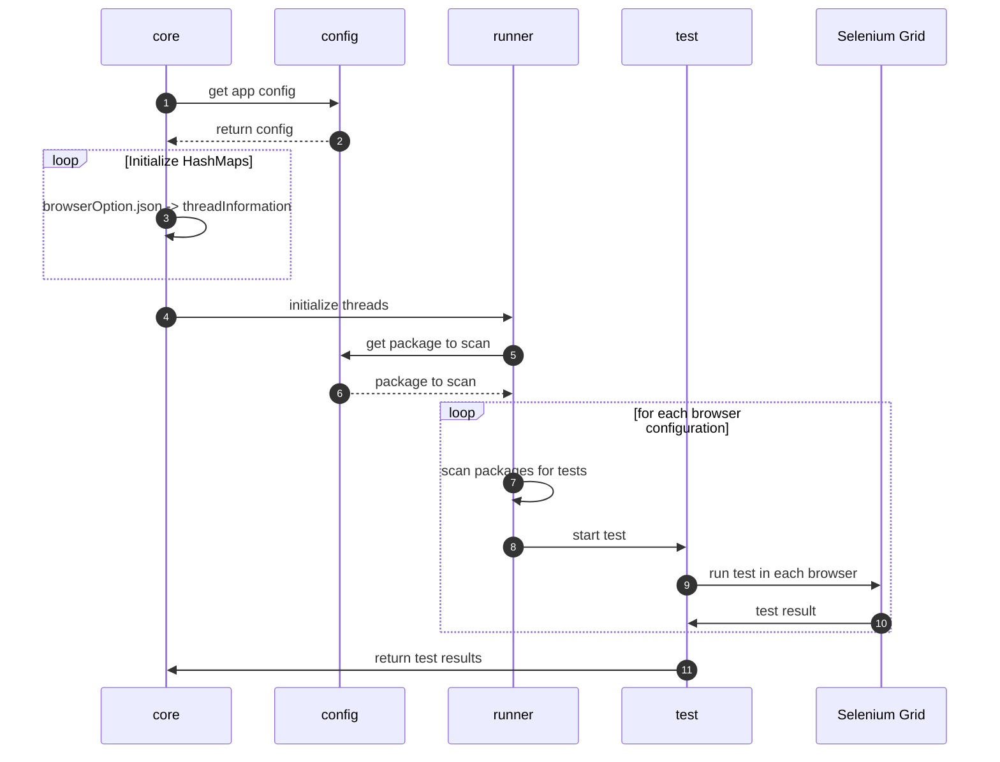

# TGWebAutoTests - движок автоматизированного тестирования web приложений

## Начало работы
1. После добавления класса с тестами необходимо над ним поставить аннотацию **@WebTest** что бы он начал выполняться при запуске программы.
2. В методе, помеченным **@Before**, заменить инициализацию **WebDriver driver**:
  ```java
  try {
            driver = BrowserOptions.getWebDriver();
        } catch (MalformedURLException e) {
            throw new RuntimeException(e);
        }
  ```
3. Изменить пакет в котором будут сканироваться тесты, URL Selenium grid, json файл с параметрами браузеров можно в _resources\config.properties_

## Подготовка Selenium
1. Подключиться по ssh к 10.242.4.178 (_ssh -l sel 10.242.4.178_)
2. Зайти в папку *docker-compose*
3. Если там нет файла *docker-compose.yaml*, то скопировать его из корня репозитория
4. Выполнить команду
```java
//start Selenium Grid and nodes with browsers
sudo docker-compose -f docker-compose.yaml up -d
//stop and delete Selenium Grid and nodes with browsers
sudo docker-compose -f docker-compose.yaml down
```
5. После успешного развертывания контейнеров можно подключиться к вэб интерфейсу Selenium - _http://10.242.4.178:4444_
6. Также можно зайти внутрь контейнера с браузером (наблюдать за выполнением тестов) перейдя по ссылке - _http://10.242.4.178:7900_ (порт нужного браузера можно посмотреть в файле docker-compose.yaml), пароль *secret*

## Структура Selenium


## Структура проекта

## Принципиальная схема работы 


### Алгоритм работы
1. При запуске приложения:
* подгружаются параметры из config.properties
* в классе **CollectionClass** на основе browserOptions.json *(класс **BrowserParameter** сериализация json -> объект)* формируется **ConcurrentHashMap<String, BrowserParameter> threadInformation**
   с количеством потоков и параметрами браузеров 
* инициализируется с нулевыми значениями **ConcurrentHashMap<Counters, Long> resultCounters** на основе **enum Counters** *(в нее будет записано количество выполненных/проваленных тестов)*
2. В MainApp параллельно запускаются потоки **TestThread** с тестами *(их количество определяется на основе кол-ва конфигураций браузеров в 1-м пункте)*, после того как они все отработали выводиться итоговая информация
3. Каждый TestThread сканирует пакеты на наличие классов с аннотацией @WebTest, их методы *(@Test)* выполняются в браузере *(сконфигурированном на основе 1-го пункта)*. 
Если тест не выполнен, то сразу выводится информация об ошибках в консоль. После завершения записывается информация в *ConcurrentHashMap<Counters, Long> resultCounters*
4. PropertiesClass служит для получения объекта Properties из которого по ключу можно получить данные из файла *config.properties*

### Настройка/изменение приложения
#### Папка resources:
* Для изменения http адреса Selenium Grid, пакета в котором приложение будет искать тесты, а также файла с параметрами браузеров необходимо отредактировать **config.properties**
* Для внесения дополнительных конфигураций браузеров в формате - "имя", "версия" - необходимо отредактировать файл **browserOptions.json**. *(Новые потоки приложение создаст автоматически)*
* Изменить уровень внутреннего логгера можно через файл **simpleLogger.properties** (в нем есть перечисление возможных уровней) 

### Порты для подключения к нодам с браузерами
Ввести в адресной строке http://10.242.4.178:{port}. Пароль для входа "secret"
#### Значения портов
* 7900 - Chrome v102
* 7901 - Chrome v100
* 7902 - Chrome v93
* 7903 - Edge v101
* 7904 - Edge v100
* 7905 - Edge v94
* 7906 - FireFox v100
* 7907 - FireFox v99
* 7908 - FireFox v93

### JavaDoc
Для формирования/обновления javadoc документации необходимо выполнить "mvn verify". Файлы с документацией хранятся в 
корне проекта и в папке "target" в одноименной папке 


